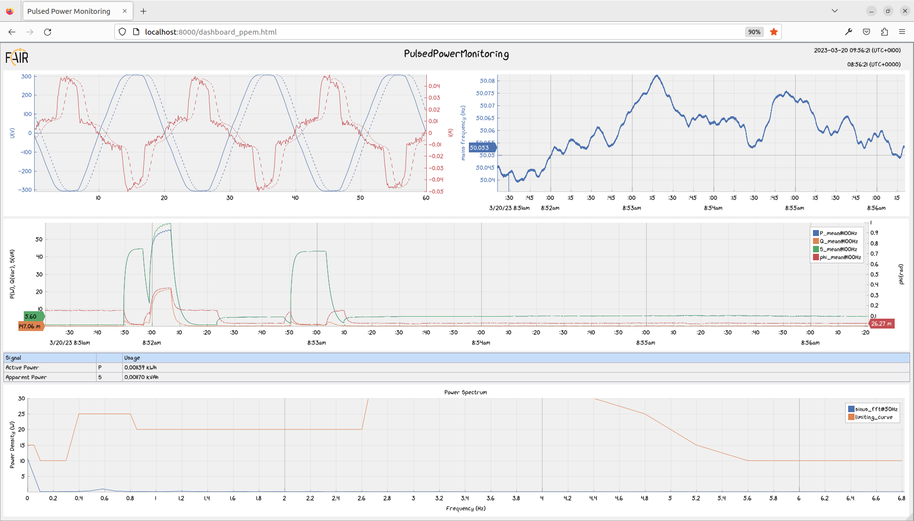
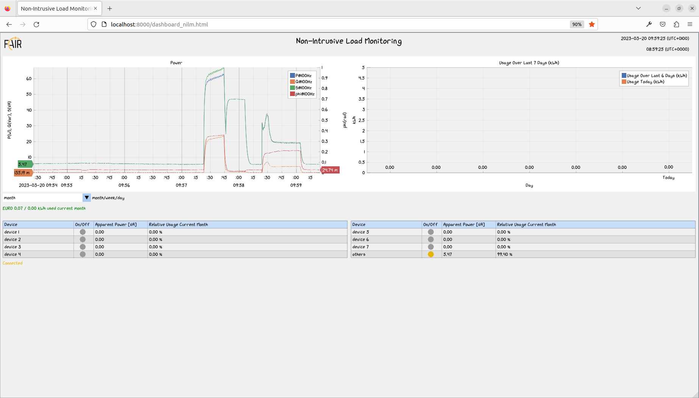
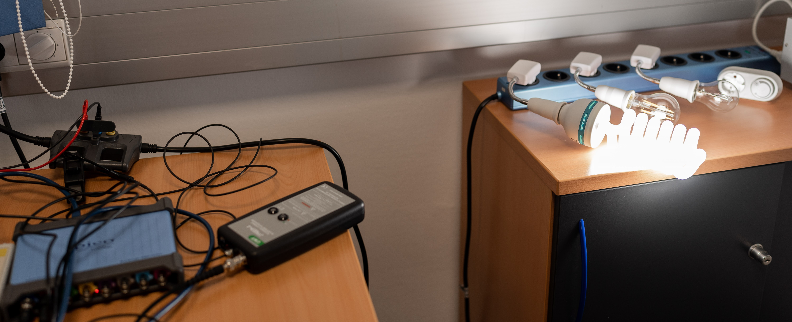
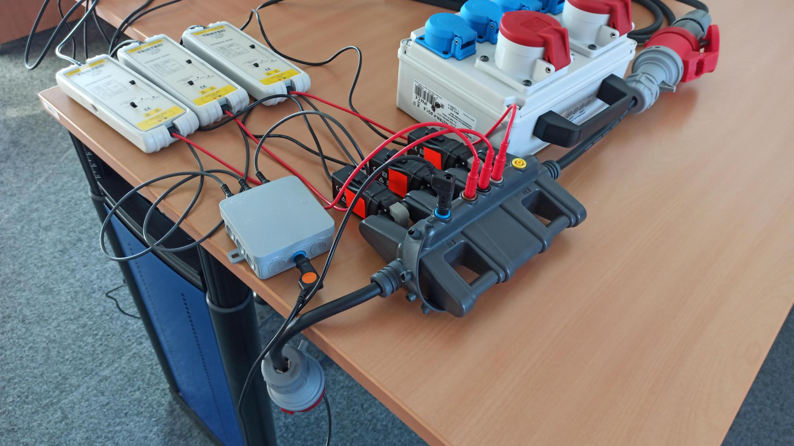
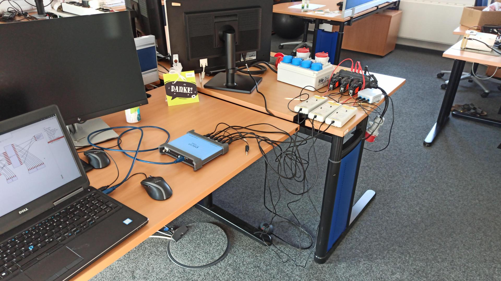
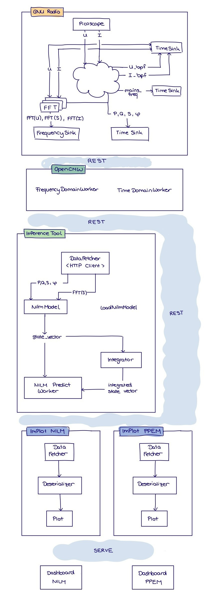
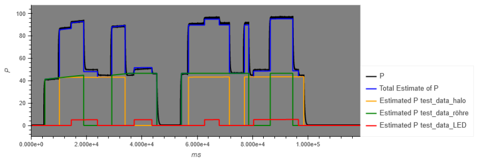

# Pulsed Power Monitoring

## Table of Contents

1. [Introduction](#introduction)
2. [Hardware Setup](#hardware_setup)
3. [Software Architecture](#software-architecture)
4. [Prerequisites](#prerequisites)
5. [Usage](#usage)

## 1 Introduction <a name="introduction"></a>

There are two main objectives of this project:

1. Pulsed Power Energy Monitoring (PPEM):  
   Develop the necessary software to visualize in real time voltage, current, frequency, phase shift, apparent-, active- and reactive power of an electric circuit with dynamic and varying appliances by only measuring voltage and current directly at the power source of the circuit.
2. Non-Intrusive Load Monitoring (NILM):  
   Disaggregate the total power consumption (active power) into the power used by each appliance in real time by utilizing only the quantities derived in the first objective.

The results of PPEM and NILM are visualized in one dashboard respectively:
| Dashboard PPEM | Dashboard NILM |
| :-------------------------------------: | :-------------------------------------: |
|  |  |

## 2 Hardware Setup <a name="hardware_setup"></a>

### One Phase

The setup consists of a multi-outlet power strip with switches for each outlet.
A measuring adapter with the the possibility to connect a clamp-on ammeter is used to connect a digitizer in order to measure voltage and current.
The digitizer has an USB-interface which is connected to a computer.
The software developed for deriving frequency, phase shift, apparent-, active- and reactive power can handle arbitrary appliances being connected to the monitored circuit.
The model used for the power disaggregation can only handle 'known' appliances with an almost static power profile.
Additionally, the model must be trained with respective training data for each appliance.
Thus, for the power disaggregation objective, three different appliances, a halogen lamp, a fluorescent lamp a an LED has been used for training and testing.



### Three Phases

The following pictures show the complete setup for the three phase tests. This setup includes

1. Current clamps - the same used for the one phase demonstrator
2. Voltage measurement - the same used for the one phase demonstrator
3. Distribution box - the neutral conductor needs to be multiplied by three for proper connection of voltage measurement
4. Three phase power connection - enables connection of different loads to the different phases
5. Three phase current and voltage measurement adapter



 |

## 3 Software Architecture <a name="software_architecture"></a>

<center></center>

### GNU-Radio Module

The processing of the raw data and the calculation of frequency, phase shift, apparent-, active- and reactive power is handled by a GNU-Radio module, which has been developed for this purpose.
An OpenCMW-interface is used to stream live data (either to a dashboard for visualization or to an algorithm for the power disaggregation).

An overview of the GNU Radio flowgraph is documented in [src/gr-pulsed_power/flowgraphs/flowgraph_simulated.grc](src/gr-pulsed_power/flowgraphs/flowgraph_simulated.grc).

### Dashboard for live data

One receiver of the data transmitted by GNU-Radio over the OpenCMW-interface is an ImPlot-Dashboard for the purpose of visualizing the received data.

### Real time power disaggregation and visualization

[outdated]  
The other receiver is a Python-package which has been developed to disaggregate the total power consumption into the power consumed per appliance in real time.
The results of this algorithm are also visualized by a dashboard.  
The approach being used for the power disaggregration is a knowledge driven engineered model.
During the development of the model, switching events and power consumption for each of the appliances have been analyzed.
The knowledge gained from this analysis is then used to automatically detect switching events in the live data and, with the subsequent change in the monitored quantities (phase shift, apparent-, active- and reactive power) it could be determined which appliance has been turned on or off.
The power profile for each appliance is modeled with affine function, which are also fitted during the 'training'.  
An example of this models performance can be seen here:



## 4 Prerequisites <a name="prerequisites"></a>

Details for setup, configuration and versions used for this project are described in the [CI workflow](.github/workflows/ci_pulsed_power_monitoring.yml).

According to the CI workflow, make sure you have the following installed:

- Ubuntu ([CI config](https://github.com/fair-acc/pulsed-power-ml/blob/develop/.github/workflows/ci_pulsed_power_monitoring.yml#L26-L28))
- GCC ([CI config](https://github.com/fair-acc/pulsed-power-ml/blob/develop/.github/workflows/ci_pulsed_power_monitoring.yml#L50-L54))
- TensorFlow ([CI config](https://github.com/fair-acc/pulsed-power-ml/blob/develop/.github/workflows/ci_pulsed_power_monitoring.yml#L73-L88))
- Picoscope dependencies ([CI config](https://github.com/fair-acc/pulsed-power-ml/blob/develop/.github/workflows/ci_pulsed_power_monitoring.yml#L91-L97))
- GNU Radio and dependencies ([CI config](https://github.com/fair-acc/pulsed-power-ml/blob/develop/.github/workflows/ci_pulsed_power_monitoring.yml#L100-L108))
- Emscripten from https://emscripten.org/docs/getting_started/downloads.html
  (the supported version can be found [here](https://github.com/fair-acc/pulsed-power-ml/blob/develop/.github/workflows/ci_pulsed_power_monitoring.yml#L169))

## 5 Usage <a name="usage"></a>

### GNU Radio

From directory [src/gr-pulsed_power/](src/gr-pulsed_power/) execute the following commands:

```bash
cmake -S . -B build
cmake --build build --target install
ldconfig
```

### PulsedPowerService & InferenceTool

From directory [src/opencmw_worker/](src/opencmw_worker/) execute the following commands:

```bash
cmake -S . -B build
cmake --build build -j4
./build/src/PulsedPowerService > /dev/null & ./build/src/InferenceTool
```

### Switching Models

For the power disaggregation multiple models were trained. You can find different models in [src/pulsed_power_ml/](src/pulsed_power_ml/). In case you want to use a different model for the InferenceTool do the following:

1. Choose a model from [src/pulsed_power_ml/](src/pulsed_power_ml/).
2. Extract the corresponding zip folder into [src/opencmw_worker/src/model/](src/opencmw_worker/src/model/).
3. Rename the extracted folder to `nilm_model`.

You don't need to build the InferenceTool again in order to use the new model.

### Dashboards

From directory [src/implot_visualization/](src/implot_visualization/) execute the following commands:

```bash
emcmake cmake -S . -B build && (cd build && emmake make -j 20)
cmake --build build --target serve
```

### View Dashboards

- Browse http://localhost:8000 to access your build.
  - The PPEM dashboard is available at http://localhost:8000/dashboard_ppem.html.
  - The NILM dashboard is available at http://localhost:8000/dashboard_nilm.html.
- The default view is short-term (showing the last 5 minutes for power and mains frequency). You can change view options by passing query parameters by the url. Just add one of the following to the url to access different views:
  - ?interval=short
  - ?interval=mid
  - ?interval=long
