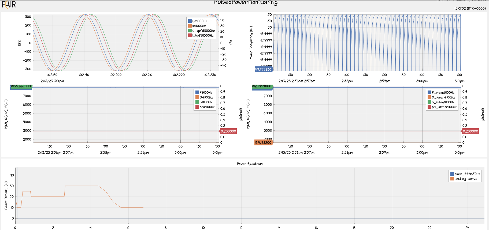
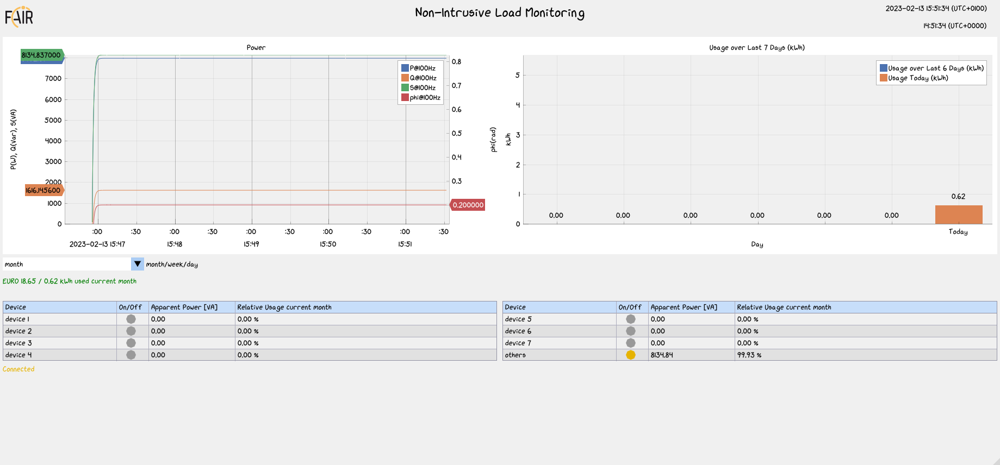
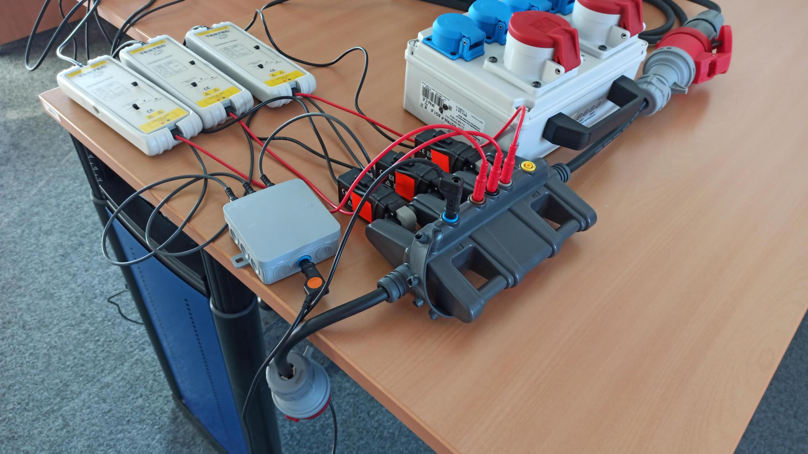
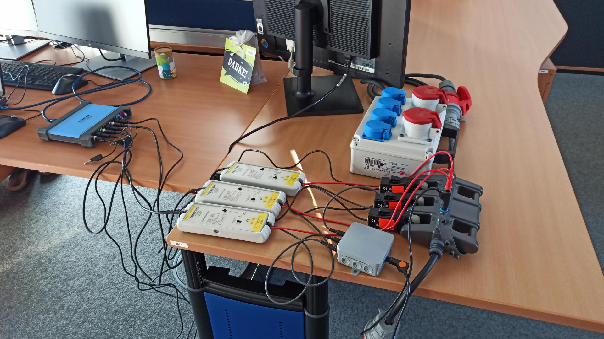
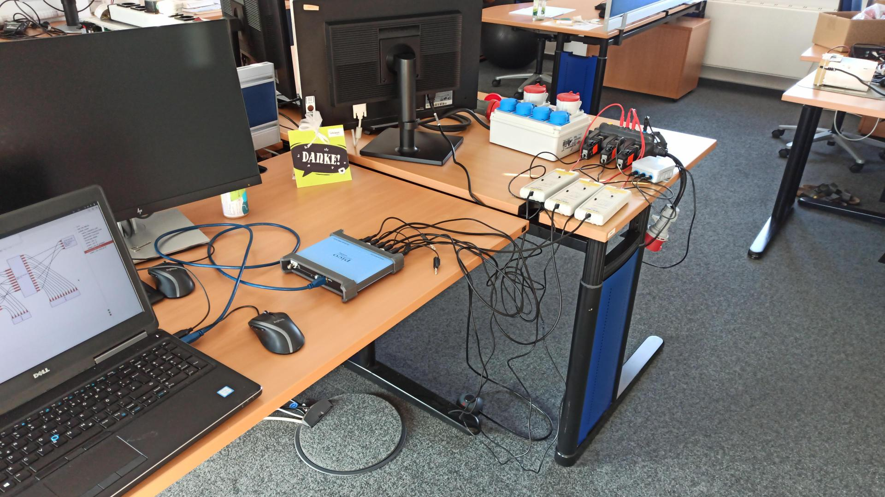

# Pulsed Power Monitoring




## Getting Started

1. Install Emscripten from https://emscripten.org/docs/getting_started/downloads.html
2. Set the environment variables as described in https://emscripten.org/docs/getting_started/downloads.html#installation-instructions
3. Build and install GNU Radio blocks as described in https://github.com/fair-acc/pulsed-power-ml/tree/main/src/gr-pulsed_power
4. Install tensorflow C from https://www.tensorflow.org/install/lang_c
5. Set the enviromnet variables as described in https://www.tensorflow.org/install/lang_c
6. Install cppflow https://github.com/serizba/cppflow

## Usage

In order to visualize data passed by OpenCMW, do the following:

1. Build and run the OpenCMW worker.
2. Build and run the ImPlot Visualization.

### Pulsed Power Service & Inference Tool

How to Build

```bash
cmake -S . -B build
cmake --build build
```

How to Run

- Run `./opencmw_worker/build/src/PulsedPowerService`
- Run `./opencmw_worker/build/src/InferenceTool`

### ImPlot Visualization

How to Build

```bash
emcmake cmake -S . -B build && (cd build && emmake make -j 20)
```

NOTE: emcmake breaks `cmake --build` so we have to call make directly

How to Run

- Run `cmake --build build --target serve`
- This will use Python3 to spawn a local webserver
- Browse http://localhost:8000 to access your build.
  - The PPEM dashboard is available at http://localhost:8000/dashboard_ppem.html.
  - The NILM dashboard is available at http://localhost:8000/dashboard_nilm.html.
- The default view is short-term (showing the last 5 minutes for power and mains frequency). You can change view options by passing query parameters by the url. Just add one of the following to the url to access different views:
  - ?interval=short
  - ?interval=mid
  - ?interval=long

# Test Setup

The following pictures show the complete setup for the three phase tests. This setup includes

1. Current clamps - the same used for the one phase demonstrator
2. Voltage measurement - the same used for the one phase demonstrator
3. Distribution box - the neutral conductor needs to be multiplied by three for proper connection of voltage measurement
4. Three phase power connection - enables connection of different loads to the different phases
5. Three phase current and voltage measurement adapter




