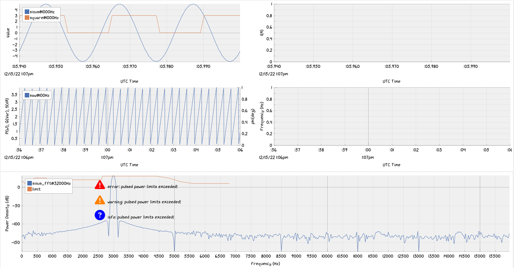

# Pulsed Power Monitoring



## Getting Started

1. Install Emscripten from https://emscripten.org/docs/getting_started/downloads.html
2. Set the environment variables as described in https://emscripten.org/docs/getting_started/downloads.html#installation-instructions
3. Build and install GNU Radio blocks as described in https://github.com/fair-acc/pulsed-power-ml/tree/main/src/gr-pulsed_power
4. Install tensorflow C from https://www.tensorflow.org/install/lang_c
5. Set the enviromnet variables as described in https://www.tensorflow.org/install/lang_c
6. Install cppflow https://github.com/serizba/cppflow

## Usage

In order to visualize data passed by OpenCMW, do the following:

1. Build and run the OpenCMW worker
2. Build and run the ImPlot Visualization.

### OpenCMW

How to Build

```bash
cmake -S . -B build
cmake --build build
```

How to Run

- Run `./opencmw_worker/build/src/PulsedPowerService`

### ImPlot Visualization

How to Build

```bash
emcmake cmake -S . -B build && (cd build && emmake make -j 20)
```

NOTE: emcmake breaks `cmake --build` so we have to call make directly

How to Run

- run `cmake --build build --target serve`
- This will use Python3 to spawn a local webserver
- Browse http://localhost:8000 to access your build.
